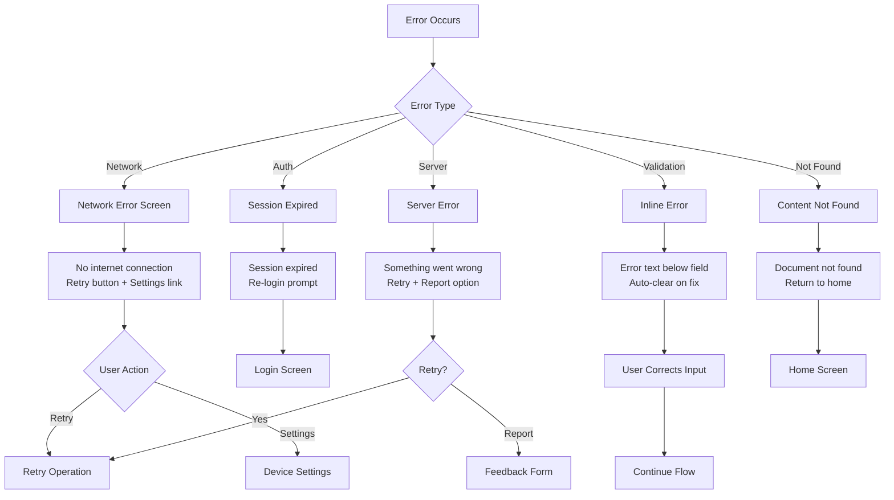

# UX Design Specification — BrainVault

**Author:** AvishkaGihan  
**Date:** January 5, 2026  
**Version:** 1.0  

---

## Executive Summary

### Project Vision

*Imagine drowning in a sea of documents — contracts, research papers, reports — desperately searching for that one paragraph you know exists somewhere. Now imagine simply asking a question and getting the exact answer, with the page number, in three seconds.*

**BrainVault** transforms how knowledge workers interact with their documents. It's not just another document viewer; it's a conversation partner for your knowledge. Users upload PDFs and text documents, then engage in natural dialogue to extract insights, find specific information, and understand complex content — all with source citations that build trust.

This is an AI-powered "Second Brain" that:
- **Remembers everything** you upload
- **Answers precisely** from your content (not generic AI training data)
- **Shows its work** with page-level citations
- **Works anywhere** on mobile, making knowledge truly portable

### Target Users

#### Primary Users

| Persona | Description | Core Need |
|---------|-------------|-----------|
| **📚 Students (Sarah)** | Law/medical/graduate students drowning in readings | Find specific information fast without reading entire documents |
| **🏠 Professionals (Marcus)** | Real estate agents, consultants, knowledge workers | Quick answers before client calls from lengthy reports |
| **🔬 Researchers (Priya)** | Research consultants juggling multiple projects | Cross-reference and synthesize information from multiple sources |
| **🔧 Technical Evaluators (David)** | Developers evaluating solutions for their companies | Understand architecture, assess quality, find implementation details |

#### User Archetypes by Tech Savviness

- **Confident Users (60%)**: Comfortable with mobile apps, expect polish and speed
- **Hesitant Users (30%)**: Need reassurance, clear feedback, forgiving error handling
- **Power Users (10%)**: Want efficiency, keyboard shortcuts (future), multi-document queries

### Key Design Challenges

1. **Building Trust in AI Responses**
   - Users are skeptical of AI-generated answers
   - Must demonstrate answers come from *their* documents, not made up
   - Source citations are not optional — they're the core trust mechanism

2. **Managing Processing Expectations**
   - Document embedding takes time (10-30 seconds for typical PDFs)
   - Users may think the app is broken if not properly informed
   - Must balance transparency with not overwhelming users

3. **Mobile-First RAG Experience**
   - Most RAG demos are web-only; mobile is novel territory
   - Touch-first interaction for document navigation and chat
   - Screen real estate is precious — every pixel must count

4. **First-Time Success Critical**
   - Portfolio demo must "wow" in under 30 seconds
   - Zero tolerance for confusion or friction in onboarding
   - Guest mode must deliver full value immediately

### Design Opportunities

1. **Differentiation Through Citations**
   - No competitor shows page-level sources as prominently
   - Make citations feel like a superpower, not a footnote
   - Tappable sources that feel magical

2. **Emotional Delight Moments**
   - The "aha!" when an answer appears in 3 seconds
   - The satisfaction of seeing "Source: Page 47" and it's correct
   - The relief of "I don't have to read 50 pages anymore"

3. **Portfolio Showcase Excellence**
   - Clean architecture visible in UX decisions
   - Professional polish that says "enterprise-ready"
   - Demo flow that tells a compelling story

---

## Core User Experience

### Defining Experience

> **"Ask your documents anything and get an answer with the source — in seconds."**

Every great product has a defining moment. For **Tinder**, it's the swipe. For **Snapchat**, it's the disappearing photo. For **BrainVault**, it's this:

*User types a question → Answer appears with "Source: Page 47" → User taps source → It's exactly right.*

This three-step magic trick is what users will tell their friends. Every design decision must protect and enhance this moment.

### Platform Strategy

| Platform | Priority | Implementation |
|----------|----------|----------------|
| **Android** | Primary | Full feature set, Material Design 3 |
| **iOS** | Secondary | Full feature set, Material Design 3 (cross-platform Flutter) |
| **Web** | Out of Scope | Not for MVP |

**Mobile-First Rationale:**
- Portfolio differentiator (most RAG demos are web-only)
- Touch-first interactions for the chat interface
- Portability — users query documents during commutes, between meetings
- Flutter enables single codebase with native performance

### Effortless Interactions

These interactions must feel completely natural — zero cognitive load:

| Interaction | Design Goal |
|-------------|-------------|
| **Uploading a document** | One tap → pick file → done (no settings, no options) |
| **Asking a question** | Type naturally, hit send — just like texting |
| **Reading an answer** | Scan instantly, source jumps out visually |
| **Tapping a citation** | Instant feedback, clear connection to source |
| **Starting as guest** | Zero forms, zero friction, immediate value |

### Critical Success Moments

| Moment | User Feeling | Design Implication |
|--------|--------------|-------------------|
| **First Answer** | "Wow, this actually works!" | Must succeed on first query — pre-populate suggestions |
| **Source Verification** | "I can trust this" | Citation must be prominent, tappable, satisfying |
| **Processing Complete** | "That was fast" | Progress indication that feels faster than reality |
| **Document Selection** | "I'm in control" | Clear document context, easy switching |
| **Error Recovery** | "No problem, I can fix this" | Helpful messages, clear retry actions |

### Experience Principles

1. **🎯 Clarity Over Cleverness**
   - Every element has one job and does it obviously
   - No hidden gestures, no buried features
   - Labels over icons where doubt exists

2. **⚡ Speed Is a Feature**
   - Perceived performance matters as much as actual performance
   - Skeleton loaders, optimistic UI, streaming responses
   - Every transition under 300ms

3. **🤝 Trust Through Transparency**
   - Always show where answers come from
   - Never pretend AI knows something it doesn't
   - "I don't have that information" is a valid, trusted response

4. **📱 Touch-First, Always**
   - 48dp minimum touch targets
   - Thumb-zone placement for primary actions
   - Generous spacing for fat-finger forgiveness

5. **🎉 Delight in Details**
   - Micro-animations that feel polished
   - Celebration of success (subtle, not annoying)
   - Personality without performance cost

---

## Desired Emotional Response

### Primary Emotional Goals

| Stage | Desired Emotion | Design Approach |
|-------|-----------------|-----------------|
| **Discovery** | Curious, Intrigued | Clean hero messaging, instant demo preview |
| **Onboarding** | Confident, Capable | One clear action, no overwhelm |
| **First Upload** | Hopeful, Slightly Anxious | Reassuring progress, clear status |
| **First Answer** | Amazed, Delighted | Speed + accuracy = magic moment |
| **Ongoing Use** | Empowered, Efficient | Reliable, fast, trustworthy |
| **Error Encounter** | Understood, Not Blamed | Friendly copy, clear recovery |

### Emotional Journey Map

```
DISCOVERY ──► ONBOARDING ──► FIRST UPLOAD ──► FIRST ANSWER ──► POWER USER
    │              │               │                │              │
Curious       Confident        Hopeful          AMAZED!       Empowered
Intrigued     "I can do this"  "Please work"    "This is      "My secret
"Interesting"                                    magic!"       weapon"
```

### Micro-Emotions

**Confidence vs. Confusion**
- Every screen answers: "What should I do next?"
- Primary actions always obvious (color, size, position)
- Never more than one major decision per screen

**Trust vs. Skepticism**
- Source citations are mandatory, not optional
- "Thinking..." shows actual work happening
- Errors are honest, not vague

**Accomplishment vs. Frustration**
- Celebrate document upload completion (subtle animation)
- Answer appearance feels like a reveal, not a load
- Progress toward goals is always visible

### Emotional Design Principles

1. **Be a Helpful Librarian, Not a Mysterious Oracle**
   - AI should feel knowledgeable but approachable
   - Responses are helpful, not mystical
   - Admit limitations honestly

2. **Reduce Anxiety at Every Step**
   - Processing states are reassuring, not scary
   - "This might take a moment" sets expectations
   - Errors include what to do next

3. **Celebrate Without Interrupting**
   - Success states are visible but don't demand attention
   - Animations enhance flow, don't block it
   - Delight is earned, not forced

---

## UX Pattern Analysis & Inspiration

### Inspiring Products Analysis

#### ChatGPT (Mobile)
**What They Nail:**
- Conversational interface feels natural
- Streaming responses reduce perceived wait time
- Simple input area that expands as needed
- Clean message threading

**What We'll Adapt:**
- Streaming response pattern for AI answers
- Message bubble design for chat flow
- Input expansion behavior

**What We'll Improve:**
- Add source citations (ChatGPT lacks this)
- Document context (ChatGPT has no document scope)
- Mobile-optimized layout (ChatGPT is web-first)

#### Notion (Mobile)
**What They Nail:**
- Information hierarchy is clear
- Documents feel organized and accessible
- Search is powerful yet simple
- Offline-first feels reliable

**What We'll Adapt:**
- Document list card design
- Clean navigation patterns
- Information density that doesn't overwhelm

#### Google Drive (Mobile)
**What They Nail:**
- File upload flow is frictionless
- Clear file states (uploading, processing, ready)
- Familiar patterns for file management

**What We'll Adapt:**
- Upload progress patterns
- File status indicators
- List/card view patterns for documents

#### Perplexity (Mobile)
**What They Nail:**
- Source citations are prominent
- Clean answer presentation
- Follow-up question suggestions

**What We'll Adapt:**
- Citation chip design (Source: Page X)
- Answer structure with clear sections
- Suggestion for follow-up queries

### Transferable UX Patterns

#### Navigation Patterns
| Pattern | Source | Application in BrainVault |
|---------|--------|---------------------------|
| Tab bar navigation | iOS/Material standard | Bottom nav: Documents, Chat, Settings |
| Pull-to-refresh | Universal mobile | Refresh document list |
| Swipe actions | iOS Mail, Gmail | Quick delete/archive on documents |
| FAB for primary action | Material Design | "New Document" action |

#### Interaction Patterns
| Pattern | Source | Application in BrainVault |
|---------|--------|---------------------------|
| Streaming text | ChatGPT | AI answer appears word-by-word |
| Skeleton loaders | Facebook, LinkedIn | Document list loading states |
| Optimistic UI | Most modern apps | Instant message send feedback |
| Haptic feedback | iOS system | Success confirmations |

#### Visual Patterns
| Pattern | Source | Application in BrainVault |
|---------|--------|---------------------------|
| Message bubbles | iMessage, WhatsApp | Chat interface design |
| Card-based lists | Notion, Trello | Document list design |
| Floating input | WhatsApp, Telegram | Chat input area |
| Chip components | Material Design | Source citations, tags |

### Anti-Patterns to Avoid

| Anti-Pattern | Why It Fails | BrainVault Approach |
|--------------|--------------|---------------------|
| **Onboarding carousels** | Nobody reads them | Jump straight to value |
| **Loading spinners with no context** | Creates anxiety | Always explain what's happening |
| **Hidden navigation** | Users feel lost | Visible, consistent navigation |
| **Forced signup before value** | Kills conversion | Guest mode first, signup later |
| **Generic error messages** | Users feel abandoned | Specific, actionable error copy |
| **Infinite scroll without landmarks** | Users feel lost | Clear document boundaries |

---

## Design System Foundation

### Design System Choice

**Selected: Material Design 3 (Material You) via Flutter**

| Factor | Decision | Rationale |
|--------|----------|-----------|
| **Framework** | Material Design 3 | Flutter's native design system, excellent documentation |
| **Customization** | Themed MD3 | Full theming with custom color palette |
| **Component Library** | flutter/material + custom | 80% MD3 components, 20% custom |
| **Design Tokens** | Flutter ThemeData | Centralized, consistent styling |

### Rationale for Selection

1. **Flutter Native Integration**
   - Material Design 3 is Flutter's first-class citizen
   - Widgets are production-ready and accessible
   - Hot reload preserves design system consistency

2. **Modern and Fresh**
   - MD3 (Material You) feels contemporary (2024+)
   - Dynamic color theming available
   - Rounded corners and softer aesthetics

3. **Portfolio Appeal**
   - Demonstrates modern design sensibility
   - Recognizable but not generic
   - Signals "I know current best practices"

4. **Development Speed**
   - 5-day sprint requires leverage
   - MD3 components cover 80% of needs
   - Custom components only where differentiation matters

### Customization Strategy

**What We'll Use As-Is:**
- AppBar, NavigationBar, FAB
- TextFields, Buttons, Chips
- Lists, Cards, Dialogs
- Progress indicators, Snackbars

**What We'll Customize:**
- Chat message bubbles (custom design)
- Source citation chips (branded styling)
- Document processing states (custom animations)
- Empty states (custom illustrations)

---

## Visual Design Foundation

### Color System

#### Brand Colors

| Token | Light Mode | Dark Mode | Usage |
|-------|------------|-----------|-------|
| **Primary** | `#6750A4` (Deep Purple) | `#D0BCFF` | Primary actions, brand identity |
| **On Primary** | `#FFFFFF` | `#381E72` | Text/icons on primary |
| **Secondary** | `#625B71` (Muted Purple) | `#CCC2DC` | Secondary actions, accents |
| **Tertiary** | `#7D5260` (Dusty Rose) | `#EFB8C8` | Highlights, special elements |

#### Semantic Colors

| Token | Light Mode | Dark Mode | Usage |
|-------|------------|-----------|-------|
| **Background** | `#FFFBFE` | `#1C1B1F` | App background |
| **Surface** | `#FFFBFE` | `#1C1B1F` | Cards, sheets |
| **Surface Variant** | `#E7E0EC` | `#49454F` | Alternate surfaces |
| **Error** | `#B3261E` | `#F2B8B5` | Error states |
| **Success** | `#146B3A` | `#81C995` | Success states |
| **Warning** | `#E65100` | `#FFB74D` | Warning states |

#### Chat-Specific Colors

| Element | Light Mode | Dark Mode |
|---------|------------|-----------|
| **User Message Bubble** | Primary Container (`#EADDFF`) | Primary Container (`#4F378B`) |
| **AI Message Bubble** | Surface Variant (`#E7E0EC`) | Surface Variant (`#49454F`) |
| **Source Citation Chip** | Tertiary Container (`#FFD8E4`) | Tertiary Container (`#633B48`) |

### Typography System

**Font Family:** Roboto (Material Design default) — excellent readability, universal support

#### Type Scale

| Style | Size | Weight | Line Height | Usage |
|-------|------|--------|-------------|-------|
| **Display Large** | 57sp | 400 | 64sp | Hero headlines (splash) |
| **Headline Large** | 32sp | 400 | 40sp | Screen titles |
| **Headline Medium** | 28sp | 400 | 36sp | Section headers |
| **Title Large** | 22sp | 400 | 28sp | Card titles |
| **Title Medium** | 16sp | 500 | 24sp | Document names |
| **Body Large** | 16sp | 400 | 24sp | Primary content, chat messages |
| **Body Medium** | 14sp | 400 | 20sp | Secondary content |
| **Body Small** | 12sp | 400 | 16sp | Captions, metadata |
| **Label Large** | 14sp | 500 | 20sp | Buttons, labels |
| **Label Small** | 11sp | 500 | 16sp | Chips, tags |

#### Chat Typography

| Element | Style | Notes |
|---------|-------|-------|
| **User Message** | Body Large | Left-aligned, primary text color |
| **AI Message** | Body Large | Left-aligned, primary text color |
| **Source Citation** | Label Large | Bold, tertiary color |
| **Timestamp** | Body Small | Muted, right-aligned |
| **"Thinking..."** | Body Medium | Italic, muted |

### Spacing & Layout Foundation

#### Spacing Scale (8dp base unit)

| Token | Value | Usage |
|-------|-------|-------|
| `space-xs` | 4dp | Tight spacing, within components |
| `space-sm` | 8dp | Related elements |
| `space-md` | 16dp | Standard spacing |
| `space-lg` | 24dp | Section spacing |
| `space-xl` | 32dp | Major sections |
| `space-2xl` | 48dp | Screen-level padding |

#### Layout Grid

- **Margins:** 16dp (mobile standard)
- **Gutters:** 16dp between elements
- **Columns:** Single-column for most views (mobile)
- **Max Content Width:** 600dp (for potential tablet optimization)

#### Touch Targets

| Element | Minimum Size | Recommended |
|---------|--------------|-------------|
| **Buttons** | 48 × 48dp | 48 × 48dp |
| **Icons (tappable)** | 48 × 48dp | 48 × 48dp |
| **List Items** | 48dp height | 56-72dp height |
| **FAB** | 56 × 56dp | 56 × 56dp |

### Accessibility Considerations

| Requirement | Implementation |
|-------------|----------------|
| **Color Contrast** | All text meets WCAG AA (4.5:1 normal, 3:1 large) |
| **Touch Targets** | Minimum 48dp × 48dp for all interactive elements |
| **Text Scaling** | Support up to 200% system font scaling |
| **Screen Reader** | Semantic labels for all interactive elements |
| **Focus Indicators** | Visible focus states for keyboard navigation |
| **Reduced Motion** | Respect system reduced-motion preference |

---

## Design Direction

### Chosen Direction: "Intelligent Simplicity"

A design direction that feels **professional**, **trustworthy**, and **effortlessly intelligent** — like having a brilliant research assistant in your pocket.

#### Visual Characteristics

| Attribute | Description |
|-----------|-------------|
| **Aesthetic** | Clean, spacious, modern with subtle depth |
| **Personality** | Helpful, confident, approachable |
| **Color Usage** | Purple primary (intelligence, creativity), generous white space |
| **Typography** | Clear hierarchy, comfortable reading sizes |
| **Shape Language** | Rounded corners (MD3 standard: 12-16dp), soft shadows |
| **Motion** | Smooth, purposeful, never jarring |
| **Density** | Comfortable (not cramped, not wasteful) |

#### Design Rationale

1. **Purple Palette**
   - Conveys intelligence and creativity
   - Differentiates from blue (common) and green (nature/money)
   - Associates with wisdom and knowledge

2. **Generous White Space**
   - Reduces cognitive load
   - Makes content feel premium
   - Supports scanning and quick comprehension

3. **Rounded Corners**
   - Friendly, approachable feel
   - Modern MD3 aesthetic
   - Softens the "AI" coldness

4. **Purposeful Motion**
   - Streaming text creates engagement
   - Subtle transitions guide attention
   - Nothing moves without reason

### Key Screen Mockups

#### Splash / Loading Screen
```
┌─────────────────────────────┐
│                             │
│                             │
│         [🧠 Logo]           │
│                             │
│        BrainVault           │
│                             │
│    Your Second Brain        │
│                             │
│       ────────────          │
│      (loading bar)          │
│                             │
└─────────────────────────────┘
```

#### Authentication Screen
```
┌─────────────────────────────┐
│                             │
│         [🧠 Logo]           │
│        BrainVault           │
│                             │
│   ┌───────────────────────┐ │
│   │ Email                 │ │
│   └───────────────────────┘ │
│   ┌───────────────────────┐ │
│   │ Password              │ │
│   └───────────────────────┘ │
│                             │
│   [    Sign In    ]  ← Primary │
│                             │
│   Don't have an account?    │
│   [   Sign Up    ] ← Secondary │
│                             │
│   ─────── or ───────        │
│                             │
│   [ Continue as Guest ] ← Text │
│                             │
└─────────────────────────────┘
```

#### Home / Document List Screen
```
┌─────────────────────────────┐
│ BrainVault            [👤]  │ ← AppBar
├─────────────────────────────┤
│                             │
│  Your Documents             │
│                             │
│  ┌───────────────────────┐  │
│  │ 📄 Contract_2026.pdf  │  │
│  │ Uploaded Jan 5, 2026  │  │
│  │ 4.2 MB • 47 pages     │  │
│  └───────────────────────┘  │
│                             │
│  ┌───────────────────────┐  │
│  │ 📄 Research_Notes.pdf │  │
│  │ Uploaded Jan 4, 2026  │  │
│  │ 2.1 MB • 23 pages     │  │
│  └───────────────────────┘  │
│                             │
│  ┌───────────────────────┐  │
│  │ 📝 Meeting_Summary    │  │
│  │ Uploaded Jan 3, 2026  │  │
│  │ Text note • ~500 words│  │
│  └───────────────────────┘  │
│                             │
│                       [+]   │ ← FAB
├─────────────────────────────┤
│ [📄] [💬] [⚙️]             │ ← Bottom Nav
└─────────────────────────────┘
```

#### Chat Interface Screen
```
┌─────────────────────────────┐
│ ← Contract_2026.pdf   [⋮]  │ ← AppBar with doc context
├─────────────────────────────┤
│                             │
│         ┌──────────────┐    │
│         │ What are the │    │ ← User bubble (right)
│         │ termination  │    │
│         │ clauses?     │    │
│         └──────────────┘    │
│                             │
│ ┌──────────────────────┐    │
│ │ The contract specifies│   │ ← AI bubble (left)
│ │ three termination     │   │
│ │ conditions:           │   │
│ │                       │   │
│ │ 1. 30-day notice...   │   │
│ │ 2. Breach of terms... │   │
│ │ 3. Mutual agreement...│   │
│ │                       │   │
│ │ [Source: Page 12] ←───────│── Citation chip
│ └──────────────────────┘    │
│                             │
├─────────────────────────────┤
│ ┌─────────────────────┐ [↑] │ ← Input area
│ │ Ask a question...   │     │
│ └─────────────────────┘     │
└─────────────────────────────┘
```

#### Processing State Screen
```
┌─────────────────────────────┐
│ ← Upload Document     [✕]   │
├─────────────────────────────┤
│                             │
│                             │
│         📄                  │
│   Contract_2026.pdf         │
│                             │
│   ━━━━━━━━━━━━━━━━━━━━━     │
│   Processing your document  │
│                             │
│   [████████░░░░░░] 65%      │
│                             │
│   📝 Extracting text...     │ ← Current step
│   ✓ Uploaded to server      │ ← Completed steps
│                             │
│   This usually takes        │
│   10-30 seconds             │
│                             │
│                             │
└─────────────────────────────┘
```

---

## User Journey Flows

### Journey 1: New User First Experience (Guest Mode)

```mermaid
flowchart TD
    A[App Launch] --> B{First time?}
    B -->|Yes| C[Splash Screen<br/>2 seconds]
    B -->|No| D[Home Screen]
    
    C --> E[Auth Screen]
    E --> F{User Choice}
    
    F -->|Guest| G[Home Screen<br/>Empty State]
    F -->|Sign Up| H[Registration Flow]
    F -->|Sign In| I[Login Flow]
    
    G --> J[Empty State CTA<br/>"Upload your first document"]
    J --> K[File Picker]
    K --> L[Processing Screen<br/>10-30 seconds]
    L --> M{Success?}
    
    M -->|Yes| N[Document Ready<br/>Success Animation]
    M -->|No| O[Error State<br/>Retry Option]
    
    N --> P[Chat Interface]
    P --> Q[Type First Question]
    Q --> R[AI Response<br/>with Citation]
    R --> S["AHA!" Moment ✨]
    
    O --> J
```

**Critical Success Points:**
- Guest mode is ONE TAP from auth screen
- First upload must succeed without confusion
- First question must produce accurate, cited answer

### Journey 2: Document Upload Flow

```mermaid
flowchart TD
    A[Tap FAB +] --> B[Upload Options Sheet]
    B --> C{Option Selected}
    
    C -->|PDF| D[File Picker<br/>PDF filter]
    C -->|Text| E[Text Input Screen]
    
    D --> F{File Valid?}
    F -->|Yes| G[Upload Started]
    F -->|No - Too Large| H[Error: Max 5MB]
    F -->|No - Wrong Type| I[Error: PDF only]
    
    E --> J[Paste/Type Text]
    J --> K[Save Button]
    K --> G
    
    G --> L[Processing Screen]
    L --> M[Step 1: Uploading...]
    M --> N[Step 2: Extracting text...]
    N --> O[Step 3: Creating embeddings...]
    O --> P[Step 4: Indexing...]
    
    P --> Q{Success?}
    Q -->|Yes| R[Success State<br/>"Document Ready!"]
    Q -->|No| S[Error State<br/>Specific message]
    
    R --> T[Navigate to Chat]
    S --> U{Retryable?}
    U -->|Yes| V[Retry Button]
    U -->|No| W[Contact Support]
    V --> G
    
    H --> B
    I --> B
```

**Error Handling:**
- "File too large" → Suggest compressing or splitting
- "Invalid format" → List supported formats
- "Network error" → Retry with preserved selection
- "Processing failed" → Offer text paste fallback

### Journey 3: Chat Interaction Flow

```mermaid
flowchart TD
    A[Enter Chat Screen] --> B[Load Chat History]
    B --> C{Has History?}
    
    C -->|Yes| D[Display Messages]
    C -->|No| E[Empty State<br/>Suggestions]
    
    D --> F[Input Area Active]
    E --> F
    
    F --> G[User Types Question]
    G --> H[Tap Send]
    H --> I[Optimistic Send<br/>Show user bubble]
    
    I --> J[Show "Thinking..."<br/>with animation]
    J --> K[API Call to Backend]
    K --> L{Response OK?}
    
    L -->|Yes| M[Stream Response]
    L -->|No - Network| N[Error: Check connection]
    L -->|No - Server| O[Error: Try again]
    
    M --> P[Display AI Message]
    P --> Q[Attach Citation Chip]
    Q --> R[Message Complete]
    
    R --> S{User Action}
    S -->|Ask Another| G
    S -->|Tap Citation| T[Highlight Source Info]
    S -->|New Document| U[Back to Home]
    
    N --> V[Retry Button]
    O --> V
    V --> K
```

**Interaction Details:**
- Send button disabled until text entered
- "Thinking..." appears within 200ms of send
- Response streams word-by-word (perceived speed)
- Citation chip appears with slight delay (emphasis)

### Journey 4: Error Recovery Patterns



**Error Message Principles:**
1. **Specific:** Tell users exactly what happened
2. **Actionable:** Include what to do next
3. **Friendly:** Never blame the user
4. **Brief:** One sentence when possible

---

## Component Strategy

### Material Design 3 Components (Use As-Is)

| Component | Usage |
|-----------|-------|
| **AppBar** | All screen headers |
| **NavigationBar** | Bottom navigation (3 destinations) |
| **FloatingActionButton** | Primary upload action |
| **Card** | Document list items |
| **TextField** | All input fields |
| **FilledButton** | Primary actions |
| **OutlinedButton** | Secondary actions |
| **TextButton** | Tertiary actions |
| **Chip** | Source citations |
| **ProgressIndicator** | Loading states (circular and linear) |
| **SnackBar** | Transient feedback |
| **Dialog** | Confirmations (delete) |
| **BottomSheet** | Upload options |
| **ListTile** | Document list items |

### Custom Components

#### 1. ChatMessageBubble

**Purpose:** Display user and AI messages in chat interface

**Anatomy:**
```
┌─────────────────────────────┐
│ Message text content that   │
│ can wrap to multiple lines  │
│                             │
│ [Citation Chip] (AI only)   │
│                    12:34 PM │
└─────────────────────────────┘
```

**Variants:**
- `ChatMessageBubble.user` — Right-aligned, primary container color
- `ChatMessageBubble.ai` — Left-aligned, surface variant color
- `ChatMessageBubble.loading` — "Thinking..." with animation

**States:**
- Default, Sending (optimistic), Error (retry option)

**Props:**
```dart
class ChatMessageBubble {
  final String message;
  final bool isUser;
  final DateTime timestamp;
  final List<SourceCitation>? citations;
  final MessageState state;
}
```

#### 2. SourceCitationChip

**Purpose:** Display tappable source reference with page number

**Anatomy:**
```
┌─────────────────────┐
│ 📄 Source: Page 47  │
└─────────────────────┘
```

**States:**
- Default: Tertiary container color
- Pressed: Darkened container
- Expanded: Shows more source context (future)

**Interaction:**
- Tap → Show toast with full source context
- Long press → Copy citation to clipboard (future)

**Props:**
```dart
class SourceCitationChip {
  final int pageNumber;
  final String? sectionName;
  final String documentName;
  final VoidCallback onTap;
}
```

#### 3. DocumentCard

**Purpose:** Display document in list with metadata and actions

**Anatomy:**
```
┌─────────────────────────────────────┐
│ 📄  Document Title                  │
│     Uploaded Jan 5, 2026            │
│     4.2 MB • 47 pages               │
│                              [⋮]    │
└─────────────────────────────────────┘
```

**States:**
- Default, Processing (with progress), Selected, Error

**Actions (overflow menu):**
- Delete document
- View document info
- (Future: Rename, Share)

**Props:**
```dart
class DocumentCard {
  final Document document;
  final VoidCallback onTap;
  final VoidCallback onDelete;
  final DocumentState state;
}
```

#### 4. ProcessingStatusCard

**Purpose:** Show document processing progress with steps

**Anatomy:**
```
┌─────────────────────────────────────┐
│         📄                          │
│   Contract_2026.pdf                 │
│                                     │
│   [████████████░░░░░] 75%           │
│                                     │
│   ✓ Uploaded                        │
│   ✓ Text extracted                  │
│   → Creating embeddings...          │
│   ○ Indexing                        │
└─────────────────────────────────────┘
```

**States:**
- Uploading, Extracting, Embedding, Indexing, Complete, Error

**Props:**
```dart
class ProcessingStatusCard {
  final String fileName;
  final ProcessingStep currentStep;
  final double progress;
  final String? errorMessage;
}
```

#### 5. EmptyState

**Purpose:** Display when document list or chat is empty

**Anatomy:**
```
┌─────────────────────────────────────┐
│                                     │
│         [Illustration]              │
│                                     │
│     Your brain is empty!            │
│                                     │
│  Upload your first document to      │
│  start having conversations         │
│  with your knowledge.               │
│                                     │
│    [ Upload Document ]              │
│                                     │
└─────────────────────────────────────┘
```

**Variants:**
- `EmptyState.documents` — No documents uploaded
- `EmptyState.chat` — No messages in conversation
- `EmptyState.search` — No search results

### Component Implementation Roadmap

**Phase 1: MVP Launch (Week 1)**
- ChatMessageBubble (user + AI variants)
- SourceCitationChip
- DocumentCard
- ProcessingStatusCard
- EmptyState.documents

**Phase 2: Polish (Week 2)**
- EmptyState.chat
- Animated processing states
- Skeleton loaders for document list

**Phase 3: Enhancement (Month 1)**
- EmptyState.search
- Rich source preview
- Advanced document card actions

---

## UX Consistency Patterns

### Button Hierarchy

| Level | Component | Usage | Color |
|-------|-----------|-------|-------|
| **Primary** | FilledButton | One per screen, main action | Primary |
| **Secondary** | OutlinedButton | Alternative actions | Outline only |
| **Tertiary** | TextButton | De-emphasized actions | Text only |
| **FAB** | FloatingActionButton | Global primary action | Primary |

**Button Placement:**
- Primary action at bottom of forms
- FAB in bottom-right corner
- Destructive actions require confirmation

### Feedback Patterns

#### Success States
| Scenario | Feedback Type | Duration |
|----------|---------------|----------|
| Document uploaded | SnackBar + Navigate | 3 seconds |
| Message sent | Optimistic UI | Instant |
| Account created | Navigate + SnackBar | Instant + 3s |

#### Error States
| Scenario | Feedback Type | Recovery |
|----------|---------------|----------|
| Network error | Inline message | Retry button |
| Validation error | Field error text | Auto-clear on fix |
| Server error | Dialog or SnackBar | Retry/Report |

#### Loading States
| Scenario | Indicator | Duration Context |
|----------|-----------|------------------|
| App launch | Splash screen | 1-3 seconds |
| Document list | Skeleton cards | 0.5-2 seconds |
| Document processing | Progress + steps | 10-30 seconds |
| Chat response | "Thinking..." animation | 1-5 seconds |
| Navigation | None (instant) | <300ms |

### Form Patterns

**Input Validation:**
- Validate on blur (not on every keystroke)
- Show error below field with icon
- Clear error when user starts typing
- Submit button disabled until valid

**Field States:**
```
Default:   ┌─────────────────┐
           │ Label           │
           └─────────────────┘
           
Focused:   ┌─────────────────┐ ← Primary color border
           │ Label   |       │
           └─────────────────┘
           
Error:     ┌─────────────────┐ ← Error color border
           │ Label           │
           └─────────────────┘
           ⚠ Error message
           
Disabled:  ┌─────────────────┐ ← Muted colors
           │ Label           │
           └─────────────────┘
```

### Navigation Patterns

**Bottom Navigation:**
- 3 destinations: Documents, Chat, Settings
- Active indicator uses primary color
- Icons + labels always visible
- Persists across all main screens

**Back Navigation:**
- Leading back arrow on detail screens
- System back button works consistently
- Swipe-to-go-back on iOS

**Screen Transitions:**
- Forward: Slide in from right
- Back: Slide out to right
- Modal: Slide up from bottom
- Dialog: Fade + scale

### Empty States Pattern

All empty states follow this structure:
1. **Illustration** — Visual context (optional icon or image)
2. **Headline** — What's empty
3. **Body** — Why it's empty or what to do
4. **CTA** — Primary action to fix the empty state

### Confirmation Patterns

**Destructive Actions (Delete):**
```
┌─────────────────────────────────┐
│                                 │
│   Delete Document?              │
│                                 │
│   "Contract_2026.pdf" will be   │
│   permanently deleted. This     │
│   cannot be undone.             │
│                                 │
│        [Cancel]  [Delete]       │
│                  ↑ Red color    │
└─────────────────────────────────┘
```

**Non-Destructive Actions:**
- No confirmation needed
- Provide undo via SnackBar when possible

---

## Responsive Design & Accessibility

### Responsive Strategy

#### Mobile-First Approach
BrainVault is designed mobile-first with potential tablet enhancement.

| Breakpoint | Width | Layout Strategy |
|------------|-------|-----------------|
| **Mobile** | < 600dp | Single column, full-width components |
| **Tablet** | 600-840dp | Optional: Two-column chat view |
| **Desktop** | > 840dp | Out of scope (use tablet layout) |

#### Mobile Layout Principles
- Single column layout for all screens
- Bottom navigation visible on all main screens
- FAB for primary action (upload)
- Chat input fixed at bottom with keyboard avoidance
- Cards span full width minus margins (16dp)

#### Tablet Considerations (Future)
- Documents list + Chat side-by-side
- Expanded document cards with more metadata
- Persistent sidebar navigation option

### Accessibility Strategy

#### WCAG Compliance Target: **Level AA**

| Criterion | Implementation |
|-----------|----------------|
| **1.1.1 Non-text Content** | All images have alt text, icons have labels |
| **1.3.1 Info & Relationships** | Semantic HTML structure, headings hierarchy |
| **1.4.1 Use of Color** | Never rely on color alone; use icons + text |
| **1.4.3 Contrast (AA)** | Minimum 4.5:1 for normal text, 3:1 for large |
| **1.4.4 Resize Text** | Support up to 200% text scaling |
| **2.1.1 Keyboard** | All functions accessible via keyboard |
| **2.4.3 Focus Order** | Logical tab order follows visual order |
| **2.4.4 Link Purpose** | Link text describes destination |
| **3.2.1 On Focus** | No automatic context changes on focus |
| **3.3.1 Error Identification** | Errors clearly identified with text |
| **3.3.2 Labels** | All inputs have visible labels |

#### Screen Reader Support

**TalkBack (Android) & VoiceOver (iOS) Testing:**

| Element | Accessibility Label |
|---------|---------------------|
| Upload FAB | "Upload new document" |
| Document Card | "Document: [name], uploaded [date], [size]" |
| Send Button | "Send message" |
| Citation Chip | "Source: Page [number], tap to view" |
| Back Button | "Go back" |

**Semantic Grouping:**
- Chat messages grouped as "Message from [user/assistant]"
- Document list announced as "Your documents, [count] items"
- Form fields grouped with fieldset semantics

#### Touch Accessibility

| Element | Minimum Size | Implementation |
|---------|--------------|----------------|
| All buttons | 48 × 48dp | Material default |
| Tappable icons | 48 × 48dp | IconButton with padding |
| List items | 48dp height minimum | ListTile default |
| Text fields | 56dp height | OutlinedTextField |

#### Color Accessibility

**Contrast Ratios (Verified):**
- Body text on background: 12:1 ✓
- Primary button text: 7:1 ✓
- Error text: 5.5:1 ✓
- Placeholder text: 4.7:1 ✓

**Color Blindness Considerations:**
- Never rely on red/green alone for status
- Use icons alongside color indicators
- Success = green + checkmark
- Error = red + exclamation icon

#### Motion Accessibility

**Reduced Motion Support:**
- Check `MediaQuery.of(context).disableAnimations`
- Skip non-essential animations
- Keep functional transitions (navigation)
- Disable streaming text effect (show complete)

### Testing Strategy

#### Responsive Testing

| Test | Method |
|------|--------|
| Screen sizes | Flutter device preview, real devices |
| Text scaling | System settings 100%, 150%, 200% |
| Orientation | Portrait primary, landscape supported |
| Keyboard | Ensure inputs remain visible |

#### Accessibility Testing

| Test | Tool |
|------|------|
| Automated scan | Flutter `flutter_test`, Accessibility Scanner |
| Screen reader | TalkBack (Android), VoiceOver (iOS) |
| Keyboard nav | External keyboard on tablet |
| Contrast | Color contrast analyzer |

#### Manual Testing Checklist

- [ ] All screens navigable with screen reader
- [ ] Focus order matches visual order
- [ ] All interactive elements have labels
- [ ] Errors announced properly
- [ ] No trapped keyboard focus
- [ ] Text scales without breaking layout
- [ ] Works with system dark mode
- [ ] Works with increased contrast setting

---

## Screen Inventory & Specifications

### Screen Inventory

| # | Screen | Priority | State Variants |
|---|--------|----------|----------------|
| 1 | Splash | MVP | Loading |
| 2 | Authentication | MVP | Login, Register, Error |
| 3 | Home / Documents | MVP | Empty, Populated, Loading |
| 4 | Upload Options | MVP | Sheet |
| 5 | Processing | MVP | Progress, Complete, Error |
| 6 | Chat | MVP | Empty, Populated, Thinking, Error |
| 7 | Settings | MVP | Logged in, Guest |
| 8 | Profile | Post-MVP | View, Edit |

### Detailed Screen Specifications

#### Screen 1: Splash
**Purpose:** App initialization and brand moment
**Duration:** 1-3 seconds (auto-navigate)

**Elements:**
- Centered logo (Brain + Vault icon)
- App name below logo
- Linear progress indicator
- Background: Surface color

**Transitions:**
- Auto-navigate to Auth (first launch) or Home (returning user)

---

#### Screen 2: Authentication
**Purpose:** User login, registration, and guest access

**Tab 1: Sign In**
- Email TextField
- Password TextField (with visibility toggle)
- "Forgot Password?" TextButton
- "Sign In" FilledButton
- Divider with "or"
- "Continue as Guest" TextButton
- "Don't have an account? Sign Up" link

**Tab 2: Sign Up**
- Email TextField
- Password TextField
- Confirm Password TextField
- "Create Account" FilledButton
- "Already have an account? Sign In" link

**Error States:**
- Invalid email format: "Please enter a valid email"
- Wrong password: "Incorrect email or password"
- Weak password: "Password must be at least 8 characters"
- Account exists: "An account with this email already exists"

---

#### Screen 3: Home / Documents
**Purpose:** Document library management

**AppBar:**
- Title: "BrainVault"
- Profile avatar (right)

**Body (Empty State):**
- Illustration of empty brain/folder
- "No documents yet"
- "Upload your first document to get started"
- "Upload Document" FilledButton

**Body (Populated):**
- Section header: "Your Documents"
- Document cards (vertically scrollable)
- Pull-to-refresh
- Swipe-to-delete (with confirmation)

**FAB:** "+" Upload new document

**Bottom Navigation:**
- Documents (active)
- Chat
- Settings

---

#### Screen 4: Upload Options
**Purpose:** Choose upload method

**Bottom Sheet:**
- Handle bar at top
- "Add to your brain" title
- Option 1: "Upload PDF" with icon + description
- Option 2: "Paste Text" with icon + description
- Cancel button

**PDF Flow:**
- System file picker (PDF filter)
- File size validation (max 5MB)
- Navigate to Processing screen

**Text Flow:**
- Full-screen text input
- Character count
- "Save" button in AppBar
- Navigate to Processing screen

---

#### Screen 5: Processing
**Purpose:** Show document processing progress

**AppBar:**
- Back arrow (with cancel confirmation)
- "Processing" title

**Body:**
- Document icon
- Document name
- Linear progress indicator with percentage
- Step list with checkmarks:
  - ✓ Uploading...
  - ✓ Extracting text...
  - → Creating embeddings...
  - ○ Indexing...
- "This usually takes 10-30 seconds"

**Complete State:**
- Success animation
- "Document Ready!"
- "Start Chatting" FilledButton

**Error State:**
- Error icon
- Error message (specific)
- "Try Again" button
- "Use Text Paste Instead" link

---

#### Screen 6: Chat
**Purpose:** Q&A conversation with document

**AppBar:**
- Back arrow
- Document name (truncated)
- Overflow menu (New chat, Document info)

**Body (Empty):**
- "Ask anything about this document"
- Suggestion chips for common questions

**Body (Populated):**
- Message list (scrollable)
- User messages (right, primary container)
- AI messages (left, surface variant)
- Citation chips on AI messages
- Timestamps (optional)

**Input Area:**
- TextField with hint "Ask a question..."
- Send IconButton (disabled when empty)
- Expands with multiline input

**Thinking State:**
- AI message bubble with "Thinking..."
- Animated dots or pulsing indicator

**Error State:**
- Error message in bubble
- "Retry" button

---

#### Screen 7: Settings
**Purpose:** App configuration and account management

**Sections:**

**Account (Logged In):**
- User email display
- "Edit Profile" ListTile
- "Sign Out" ListTile (destructive)

**Account (Guest):**
- "You're using guest mode"
- "Create Account" to save your data

**Appearance:**
- Theme toggle (System/Light/Dark)

**About:**
- App version
- "Privacy Policy" link
- "Terms of Service" link

**Danger Zone:**
- "Delete Account" (with confirmation)

---

## Implementation Notes for Development

### Flutter Architecture Alignment

This UX specification aligns with the proposed Flutter architecture from the PRD:

```
lib/
├── features/
│   ├── auth/              → Screens 1, 2, 7 (partial)
│   ├── documents/         → Screens 3, 4, 5
│   └── chat/              → Screen 6
├── core/
│   └── theme/             → All design tokens from this spec
└── shared/
    └── widgets/           → Custom components from this spec
```

### Theme Implementation

```dart
// Suggested ThemeData structure
ThemeData brainVaultTheme = ThemeData(
  useMaterial3: true,
  colorScheme: ColorScheme.fromSeed(
    seedColor: Color(0xFF6750A4), // Primary purple
    brightness: Brightness.light,
  ),
  textTheme: // Roboto with scale from this spec
  inputDecorationTheme: // Outlined fields
  elevatedButtonTheme: // Filled buttons
  chipTheme: // Citation chips
);
```

### State Management Considerations

| State Type | Recommendation |
|------------|----------------|
| Auth state | Riverpod Provider |
| Document list | Riverpod StateNotifier + FutureProvider |
| Chat messages | Riverpod StateNotifier |
| Processing status | Riverpod StreamProvider |
| Theme | Riverpod Provider |

### Animation Guidelines

| Animation | Duration | Curve |
|-----------|----------|-------|
| Screen transition | 300ms | Easing.standard |
| Button press | 100ms | Easing.standard |
| Skeleton shimmer | 1500ms | Linear (loop) |
| Success checkmark | 400ms | Easing.emphasizedDecelerate |
| Chat bubble appear | 200ms | Easing.standard |
| Streaming text | 20ms per character | Linear |

---

## Appendix

### A. Design Token Reference

#### Colors (Hex Values)

**Light Mode:**
```
Primary: #6750A4
On Primary: #FFFFFF
Primary Container: #EADDFF
On Primary Container: #21005E
Secondary: #625B71
Tertiary: #7D5260
Surface: #FFFBFE
Surface Variant: #E7E0EC
Background: #FFFBFE
Error: #B3261E
Success: #146B3A
```

**Dark Mode:**
```
Primary: #D0BCFF
On Primary: #381E72
Primary Container: #4F378B
On Primary Container: #EADDFF
Secondary: #CCC2DC
Tertiary: #EFB8C8
Surface: #1C1B1F
Surface Variant: #49454F
Background: #1C1B1F
Error: #F2B8B5
Success: #81C995
```

#### Spacing Scale

```
4dp, 8dp, 12dp, 16dp, 24dp, 32dp, 48dp, 64dp
```

#### Border Radius Scale

```
Small: 8dp (chips, tags)
Medium: 12dp (cards, buttons)
Large: 16dp (sheets, dialogs)
Full: 50% (avatars, FAB)
```

### B. Copywriting Guidelines

**Voice & Tone:**
- Helpful but not condescending
- Confident but not arrogant
- Clear and concise
- Friendly without being too casual

**Error Messages:**
- Specific: Say what went wrong
- Actionable: Say what to do next
- Friendly: Never blame the user

**Examples:**
```
✓ "Couldn't upload document. Check your internet connection and try again."
✗ "Upload failed."

✓ "I don't have information about that in your document."
✗ "I don't know."

✓ "Your document is ready! Tap to start chatting."
✗ "Processing complete."
```

### C. Future Considerations

**Post-MVP Enhancements:**
1. Multi-document queries (cross-reference)
2. Source highlighting (tap citation → see exact text)
3. Export conversation as PDF
4. Voice input for questions
5. Folder organization for documents
6. Follow-up question suggestions

**Technical Debt to Avoid:**
- Hardcoding colors (use theme)
- Magic numbers for spacing
- Inconsistent error handling
- Missing loading states
- Accessibility as afterthought

---

## Document Completion

**✅ UX Design Specification Complete**

This document provides a comprehensive guide for designing and implementing the BrainVault mobile application. It covers:

- Executive summary and user understanding
- Core experience and emotional design goals
- Pattern analysis and inspiration sources
- Design system and visual foundation
- Detailed user journey flows with Mermaid diagrams
- Component strategy and specifications
- UX consistency patterns
- Responsive design and accessibility requirements
- Screen inventory with detailed specifications

**Next Recommended Steps:**
1. **Wireframe Generation** — Create low-fidelity layouts for each screen
2. **Interactive Prototype** — Build clickable prototype for user testing
3. **Solution Architecture** — Technical architecture aligned with UX requirements
4. **Visual Design in Figma** — High-fidelity mockups using this specification

---

*Document prepared with 🎨 by Sally, UX Designer*
*For the brainvault-rag-mobile project by AvishkaGihan*
