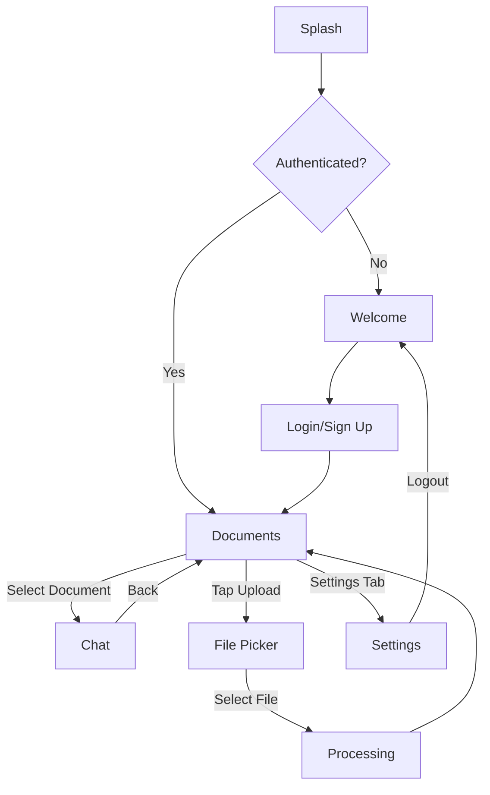
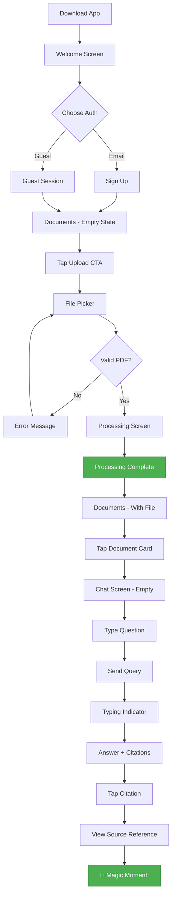
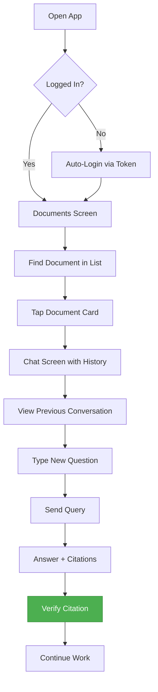

# UX Design Specification - BrainVault

**Author:** Rusit
**Date:** 2025-12-21
**Version:** 1.0

---

## Executive Summary

### Project Vision

**BrainVault** is a "Second Brain" mobile application that transforms how professionals, students, and researchers interact with their documents — from passive storage to active knowledge retrieval. Users can capture knowledge (PDF documents), and interact with their data through AI-powered natural language conversations using Retrieval-Augmented Generation (RAG) technology.

The core value proposition: *"Ask your documents anything and get accurate, cited answers in seconds."*

### Target Users

|Persona|Description|Primary Goal|Pain Point|
|---|---|---|---|
|**Priya (Law Student)**|Second-year law student drowning in case law|Find specific precedents quickly|Hours spent with Ctrl+F searching PDFs|
|**Marcus (Procurement Manager)**|Reviews 5-10 contracts weekly|Identify unfavorable terms without missing anything|Fear of missing critical clauses|
|**Dr. Okafor (Researcher)**|Biomedical researcher with 40+ papers|Cross-reference studies for literature reviews|Manual cross-referencing takes weeks|

### Key Design Challenges

1. **Trust Through Transparency** — Users must trust AI-generated answers. Source citations aren't optional; they're the foundation of credibility.
2. **Cognitive Load Reduction** — Transform complex document querying into natural conversation without learning curves.
3. **Processing Anxiety** — Document ingestion takes time; users need confidence the system is working and their content is being understood.
4. **Error Graceful Degradation** — When AI can't answer, users should understand *why* and know what to do next.

### Design Opportunities

1. **Magic Moment Design** — The first successful query with accurate citation creates an "aha!" moment that drives retention.
2. **Conversational UI** — Chat-based interaction feels modern and intuitive for all skill levels.
3. **Portfolio Showcase** — Clean, polished Material Design 3 implementation demonstrates professional quality to potential B2B clients.
4. **Mobile-First Intelligence** — AI power in pocket, available anywhere documents are needed.

---

## 1. Design System Foundation

### 1.1 Design System Choice

**Selected System:** Material Design 3 (Material You) via Flutter's Material Library

**Rationale:**

- Native Flutter support ensures optimal performance and reduced maintenance
- Comprehensive component library covers 90%+ of MVP needs
- Built-in accessibility features (semantic labels, contrast ratios)
- Dynamic theming capabilities for future customization
- Industry recognition for professional, modern aesthetics
- Excellent documentation and community support

### 1.2 Implementation Approach

|Component Type|Strategy|Source|
|---|---|---|
|**Foundation Components**|Use Material 3 widgets directly|Flutter Material Library|
|**Extended Components**|Customize Material base classes|Custom themed widgets|
|**Domain-Specific Components**|Build from primitives|Custom implementation|

### 1.3 Customization Strategy

Material 3 will be customized using a cohesive theme that reflects BrainVault's brand identity:

- **Color Scheme:** Custom seed color with dynamic color support
- **Typography:** System fonts for reliability + optional Google Fonts
- **Shape System:** Rounded corners (12dp for cards, 24dp for FABs) for approachable feel
- **Elevation System:** Subtle shadows for depth without visual noise

---

## 2. Core User Experience

### 2.1 Defining Experience

**Core Interaction:** *"Ask your document a question, get a cited answer instantly."*

This is BrainVault's Spotify moment — the defining interaction that, if nailed perfectly, makes everything else follow. Every design decision must optimize for this single user journey:

1. User has a question about their document
2. User types the question naturally
3. AI processes and retrieves relevant context
4. Answer appears with source citations
5. User verifies and trusts the answer

**Success Criteria:**

- Time from question submit to answer display: < 5 seconds
- User can verify source citation with one tap
- Answer is accurate and grounded in document content
- Follow-up questions maintain conversation context

### 2.2 User Mental Model

**Current Solutions Users Bring:**

- Ctrl+F keyword searching (limited, exact match only)
- Manual highlighting and note-taking (time-consuming)
- Reading entire documents (exhausting, unreliable memory)
- Using generic AI chatbots (hallucinate, no document context)

**BrainVault Mental Model:**

- "It's like having a research assistant who read my entire document"
- "I'm having a conversation with my textbook"
- "The AI only knows what I uploaded — no making things up"

### 2.3 Novel UX Patterns

BrainVault introduces **Grounded AI Conversation** — a pattern where:

- AI responses are constrained to user-provided context
- Every answer includes verifiable citations
- "I don't know" is an acceptable, trustworthy response
- Users can trace any claim back to source material

This differs from generic AI chat (no constraints) and traditional search (keyword matching only).

### 2.4 Experience Mechanics

**Query Flow Mechanics:**

```text
┌─────────────────────────────────────────────────────────────┐
│ 1. INITIATION                                               │
│    • User taps text input field                             │
│    • Keyboard appears, cursor blinks                        │
│    • Placeholder: "Ask about this document..."              │
└─────────────────────────────────────────────────────────────┘
                            ↓
┌─────────────────────────────────────────────────────────────┐
│ 2. INPUT                                                    │
│    • User types natural language question                   │
│    • Send button activates when text is present             │
│    • User taps send or presses enter                        │
└─────────────────────────────────────────────────────────────┘
                            ↓
┌─────────────────────────────────────────────────────────────┐
│ 3. PROCESSING (Anxiety Reduction)                           │
│    • User message appears immediately (optimistic UI)       │
│    • Typing indicator shows "BrainVault is thinking..."     │
│    • Subtle animation indicates processing                  │
└─────────────────────────────────────────────────────────────┘
                            ↓
┌─────────────────────────────────────────────────────────────┐
│ 4. RESPONSE                                                 │
│    • AI answer appears with smooth animation                │
│    • Source citation chip(s) displayed below answer         │
│    • Chat history scrolls to show full response             │
└─────────────────────────────────────────────────────────────┘
                            ↓
┌─────────────────────────────────────────────────────────────┐
│ 5. VERIFICATION (Trust Building)                            │
│    • User taps source citation chip                         │
│    • Shows document name + page number reference            │
│    • Future: Navigate to exact location in PDF viewer       │
└─────────────────────────────────────────────────────────────┘
```

---

## 3. Desired Emotional Response

### 3.1 Primary Emotional Goals

|Moment|Desired Emotion|Design Approach|
|---|---|---|
|**First Upload**|Relief & Hope|"Finally, I don't have to read all this"|
|**First Successful Query**|Magic & Delight|Accurate answer appears instantly with citation|
|**Source Verification**|Trust & Confidence|User confirms AI got it right|
|**Return Visit**|Efficiency & Control|"My documents are organized and searchable"|

### 3.2 Emotional Journey Mapping

```text
Discovery → Hope → Onboarding → Curiosity → First Upload → Anticipation
    ↓
Processing → Patience (reduced by clear feedback)
    ↓
First Query → Excitement → Magic Moment → Delight
    ↓
Verification → Trust Building → Confidence
    ↓
Repeat Usage → Efficiency → Mastery → Advocacy ("You have to try this!")
```

### 3.3 Emotions to Avoid

|Negative Emotion|Trigger|Prevention Strategy|
|---|---|---|
|**Confusion**|Unclear next steps|Prominent CTAs, onboarding hints|
|**Frustration**|Slow processing, no feedback|Progress indicators, skeleton loaders|
|**Distrust**|AI hallucination or wrong answers|Strict RAG grounding, honest "I don't know"|
|**Anxiety**|Upload failure, lost data|Clear error messages, recovery guidance|
|**Overwhelm**|Too many options|Minimal MVP interface, progressive disclosure|

### 3.4 Emotional Design Principles

1. **Confidence Through Transparency** — Always show what's happening and why
2. **Delight Through Speed** — Instant feedback, sub-5-second responses
3. **Trust Through Honesty** — Admit limitations, cite every claim
4. **Control Through Simplicity** — One primary action per screen
5. **Accomplishment Through Progress** — Clear success states and celebrations

---

## 4. Visual Design Foundation

### 4.1 Color System

**Primary Palette:**

|Token|Value|Usage|
|---|---|---|
|`primary`|#6750A4 (Deep Purple)|Primary actions, app bar, FAB|
|`onPrimary`|#FFFFFF|Text/icons on primary surfaces|
|`primaryContainer`|#EADDFF|Document cards, chat bubbles (AI)|
|`onPrimaryContainer`|#21005D|Text on containers|

**Secondary Palette:**

|Token|Value|Usage|
|---|---|---|
|`secondary`|#625B71|Secondary actions|
|`secondaryContainer`|#E8DEF8|Source citation chips|
|`onSecondaryContainer`|#1D192B|Text on secondary containers|

**Surface & Background:**

|Token|Light Mode|Dark Mode|Usage|
|---|---|---|---|
|`surface`|#FFFBFE|#1C1B1F|Card backgrounds, dialogs|
|`surfaceVariant`|#E7E0EC|#49454F|Chat input area|
|`background`|#FFFBFE|#1C1B1F|Screen background|

**Semantic Colors:**

|Token|Value|Usage|
|---|---|---|
|`success`|#386A20|Upload complete, successful action|
|`error`|#B3261E|Validation errors, failures|
|`warning`|#7D5700|Caution states, limitations|
|`info`|#0062A1|Helpful hints, tooltips|

**Accessibility Compliance:**

- All text meets WCAG AA contrast ratio (4.5:1 for normal, 3:1 for large)
- Interactive elements have 3:1 contrast against adjacent colors
- Color is never the sole indicator of state

### 4.2 Typography System

**Type Scale (Material 3):**

|Style|Font|Size|Weight|Line Height|Usage|
|---|---|---|---|---|---|
|`displayLarge`|Roboto|57sp|400|64sp|Splash screen, marketing|
|`headlineLarge`|Roboto|32sp|400|40sp|Screen titles|
|`headlineMedium`|Roboto|28sp|400|36sp|Section headers|
|`titleLarge`|Roboto|22sp|400|28sp|App bar titles|
|`titleMedium`|Roboto|16sp|500|24sp|Document names, card titles|
|`bodyLarge`|Roboto|16sp|400|24sp|Chat messages, primary content|
|`bodyMedium`|Roboto|14sp|400|20sp|Secondary content, descriptions|
|`labelLarge`|Roboto|14sp|500|20sp|Buttons, tabs|
|`labelSmall`|Roboto|11sp|500|16sp|Timestamps, metadata|

**Typography Guidelines:**

- Use system fonts (Roboto) for performance and accessibility
- Maximum 2 type weights per screen for visual harmony
- Maintain consistent heading hierarchy across all screens

### 4.3 Spacing & Layout

**Spacing Scale (8dp base unit):**

|Token|Value|Usage|
|---|---|---|
|`xs`|4dp|Inline spacing, icon padding|
|`sm`|8dp|Related element spacing|
|`md`|16dp|Section spacing, card padding|
|`lg`|24dp|Major section separation|
|`xl`|32dp|Screen edge margins|
|`2xl`|48dp|Between major sections|

**Layout Grid:**

- Single column layout for mobile focus
- 16dp horizontal margins on screens
- Cards use 12dp internal padding
- Bottom navigation: 80dp height

**Touch Targets:**

- Minimum 48x48dp touch target for all interactive elements
- Recommended 56dp for primary actions
- FAB: 56dp diameter standard

### 4.4 Shape System

|Component|Corner Radius|Shape|
|---|---|---|
|Buttons (filled)|20dp|Full rounded|
|Cards|12dp|Medium rounded|
|Dialogs|28dp|Extra rounded|
|Text Fields|4dp top|Slightly rounded top|
|FAB|16dp|Rounded|
|Chips|8dp|Small rounded|

### 4.5 Elevation & Shadow

|Level|Elevation|Usage|
|---|---|---|
|0|0dp|Base surfaces|
|1|1dp|Cards, chat messages|
|2|3dp|App bar, bottom navigation|
|3|6dp|FAB resting state|
|4|8dp|Dialogs, modals|
|5|12dp|FAB pressed state|

---

## 5. Screen Inventory & Information Architecture

### 5.1 Application Structure

```text
BrainVault
├── Splash Screen
├── Authentication Flow
│   ├── Welcome Screen
│   ├── Login Screen
│   ├── Sign Up Screen
│   └── Password Reset Screen
├── Main App (Authenticated)
│   ├── Documents Screen (Home)
│   │   ├── Empty State
│   │   ├── Document List
│   │   └── Document Actions
│   ├── Document Chat Screen
│   │   ├── Chat Messages
│   │   ├── Source Citations
│   │   └── Chat Input
│   ├── Upload Flow
│   │   ├── File Selection
│   │   └── Processing Status
│   └── Settings Screen
│       ├── Account Info
│       ├── Theme Preference
│       └── Logout
└── Error States
    ├── Network Error
    ├── Processing Error
    └── Not Found
```

### 5.2 Navigation Model

**Primary Navigation:** Bottom Navigation Bar (3 destinations for MVP)

|Tab|Icon|Label|Screen|
|---|---|---|---|
|1|folder_outlined|Documents|Document List|
|2|add_circle|Upload|File Picker Modal|
|3|settings_outlined|Settings|Settings Screen|

**Navigation Flows:**


```mermaid
graph TD
    A[Splash] --> B{Authenticated?}
    B -->|No| C[Welcome]
    B -->|Yes| D[Documents]
    C --> E[Login/Sign Up]
    E --> D
    D -->|Select Document| F[Chat]
    D -->|Tap Upload| G[File Picker]
    G -->|Select File| H[Processing]
    H --> D
    F -->|Back| D
    D -->|Settings Tab| I[Settings]
    I -->|Logout| C
```

### 5.3 Screen Specifications

#### 5.3.1 Splash Screen

**Purpose:** Brand impression, auth check, loading state

**Layout:**

```text
┌────────────────────────────────────┐
│                                    │
│                                    │
│                                    │
│           [App Icon]               │
│          BrainVault                │
│      "Your Second Brain"           │
│                                    │
│         [Loading Dot]              │
│                                    │
│                                    │
└────────────────────────────────────┘
```

**Behavior:**

- Display for minimum 1.5 seconds (brand impression)
- Check authentication state in background
- Navigate to Welcome (unauthenticated) or Documents (authenticated)

---

#### 5.3.2 Welcome Screen

**Purpose:** Value proposition, authentication entry points

**Layout:**

```text
┌────────────────────────────────────┐
│                                    │
│     [Illustration/Animation]       │
│     "Chat with your documents"     │
│                                    │
│  ┌──────────────────────────────┐  │
│  │     Get Started (Email)      │  │
│  └──────────────────────────────┘  │
│                                    │
│  ┌──────────────────────────────┐  │
│  │     Continue as Guest        │  │
│  └──────────────────────────────┘  │
│                                    │
│    Already have an account?        │
│           [Log In]                 │
│                                    │
└────────────────────────────────────┘
```

**Content:**

- Hero illustration showing document → chat concept
- Primary CTA: Email sign up
- Secondary CTA: Guest login (low friction trial)
- Text link: Login for existing users

---

#### 5.3.3 Login Screen

**Purpose:** Authenticate existing users

**Layout:**

```text
┌────────────────────────────────────┐
│  [←]                               │
│                                    │
│         Welcome back               │
│                                    │
│  ┌──────────────────────────────┐  │
│  │ Email                        │  │
│  └──────────────────────────────┘  │
│                                    │
│  ┌──────────────────────────────┐  │
│  │ Password                  [👁]│  │
│  └──────────────────────────────┘  │
│                                    │
│         [Forgot Password?]         │
│                                    │
│  ┌──────────────────────────────┐  │
│  │          Log In              │  │
│  └──────────────────────────────┘  │
│                                    │
│  Don't have an account? [Sign Up]  │
└────────────────────────────────────┘
```

**Validation:**

- Email: Valid email format required
- Password: Minimum 6 characters
- Show inline errors below respective fields
- Disable button until form is valid

---

#### 5.3.4 Sign Up Screen

**Purpose:** Create new user account

**Layout:**

```text
┌────────────────────────────────────┐
│  [←]                               │
│                                    │
│      Create your account           │
│                                    │
│  ┌──────────────────────────────┐  │
│  │ Email                        │  │
│  └──────────────────────────────┘  │
│                                    │
│  ┌──────────────────────────────┐  │
│  │ Password                  [👁]│  │
│  └──────────────────────────────┘  │
│  • At least 6 characters           │
│                                    │
│  ┌──────────────────────────────┐  │
│  │ Confirm Password          [👁]│  │
│  └──────────────────────────────┘  │
│                                    │
│  ┌──────────────────────────────┐  │
│  │        Create Account        │  │
│  └──────────────────────────────┘  │
│                                    │
│  Already have an account? [Log In] │
└────────────────────────────────────┘
```

---

#### 5.3.5 Documents Screen (Home)

**Purpose:** View all documents, primary navigation hub

**Layout — Empty State:**

```text
┌────────────────────────────────────┐
│  Documents                    [⚙]  │
├────────────────────────────────────┤
│                                    │
│                                    │
│         [Empty Illustration]       │
│                                    │
│     No documents yet               │
│                                    │
│   Upload your first PDF to start   │
│    chatting with your documents    │
│                                    │
│  ┌──────────────────────────────┐  │
│  │     Upload Your First PDF    │  │
│  └──────────────────────────────┘  │
│                                    │
│                                    │
├────────────────────────────────────┤
│ [📁 Docs]    [➕ Upload]   [⚙ Set] │
└────────────────────────────────────┘
```

**Layout — With Documents:**

```text
┌────────────────────────────────────┐
│  Documents                    [⚙]  │
├────────────────────────────────────┤
│  ┌──────────────────────────────┐  │
│  │ 📄 Contract_2024.pdf        │  │
│  │    Uploaded Dec 20 • 4.2 MB  │  │
│  │    15 pages                 [⋮]│  │
│  └──────────────────────────────┘  │
│                                    │
│  ┌──────────────────────────────┐  │
│  │ 📄 Research_Notes.pdf       │  │
│  │    Uploaded Dec 19 • 2.1 MB  │  │
│  │    8 pages                  [⋮]│  │
│  └──────────────────────────────┘  │
│                                    │
│  ┌──────────────────────────────┐  │
│  │ 📄 Case_Study.pdf  PROCESSING│  │
│  │    [████████░░] 80%          │  │
│  └──────────────────────────────┘  │
│                                    │
│                             [+ FAB]│
├────────────────────────────────────┤
│ [📁 Docs]    [➕ Upload]   [⚙ Set] │
└────────────────────────────────────┘
```

**Document Card States:**

- **Default:** Ready to chat
- **Processing:** Progress bar, disabled tap
- **Error:** Red indicator, retry action
- **Deleting:** Fade out animation

**Actions:**

- Tap card → Navigate to Chat Screen
- Tap overflow menu (⋮) → Delete option
- Tap FAB (+) → File picker

---

#### 5.3.6 Document Chat Screen

**Purpose:** Core experience — query documents, view answers with citations

**Layout:**

```text
┌────────────────────────────────────┐
│  [←] Contract_2024.pdf       [⋮]  │
├────────────────────────────────────┤
│                                    │
│  ┌──────────────────────────────┐  │
│  │ What is the termination     │  │
│  │ clause?                     │  │
│  └──────────────────────────────┘  │
│                                    │
│       ┌────────────────────────┐   │
│       │ The contract includes  │   │
│       │ the following termina- │   │
│       │ tion provisions:       │   │
│       │                        │   │
│       │ 1. Either party may    │   │
│       │ terminate with 90 days │   │
│       │ written notice...      │   │
│       │                        │   │
│       │ [📄 Page 12] [📄 Page 14]│   │
│       └────────────────────────┘   │
│                                    │
│  ┌──────────────────────────────┐  │
│  │ Can I terminate early?      │  │
│  └──────────────────────────────┘  │
│                                    │
│       ┌────────────────────────┐   │
│       │ ● ● ●                  │   │
│       │ (typing indicator)     │   │
│       └────────────────────────┘   │
│                                    │
├────────────────────────────────────┤
│ ┌────────────────────────┐  [➤]   │
│ │ Ask about this document│        │
│ └────────────────────────┘        │
└────────────────────────────────────┘
```

**Message Types:**

- **User Message:** Right-aligned, primary container color
- **AI Response:** Left-aligned, surface color, with citation chips
- **Typing Indicator:** Animated dots, "BrainVault is thinking..."
- **Error Message:** Inline error with retry option

**Citation Chip Behavior:**

- Displays as `[📄 Page X]` or `[📄 Document Name, Page X]`
- Tappable — shows source details (future: navigate to page)
- Multiple chips for multi-source answers

---

#### 5.3.7 Upload Flow

**Purpose:** Add new documents to knowledge base

**Flow:**

1. **File Selection (System Picker)**

   - Use native file picker
   - Filter: PDF only, max 5MB
   - Show validation error if invalid

2. **Processing Status (Modal or Full Screen)**

```text
┌────────────────────────────────────┐
│                                    │
│         Processing Document        │
│                                    │
│     ┌──────────────────────────┐   │
│     │      [Document Icon]      │   │
│     │    Contract_2024.pdf     │   │
│     └──────────────────────────┘   │
│                                    │
│     [████████████░░░░░░] 65%       │
│                                    │
│     Extracting text...             │
│                                    │
│     This usually takes 30 seconds  │
│                                    │
│                                    │
│          [Cancel Upload]           │
│                                    │
└────────────────────────────────────┘
```

**Processing Stages (for status message):**

- "Uploading document..."
- "Extracting text..."
- "Creating knowledge base..."
- "Almost done..."
- "Ready to chat!"

---

#### 5.3.8 Settings Screen

**Purpose:** Account management, app preferences

**Layout:**

```text
┌────────────────────────────────────┐
│  [←] Settings                      │
├────────────────────────────────────┤
│                                    │
│  ACCOUNT                           │
│  ┌──────────────────────────────┐  │
│  │ 👤 rusit@email.com          │  │
│  │    Signed in with Email     [>]│  │
│  └──────────────────────────────┘  │
│                                    │
│  APPEARANCE                        │
│  ┌──────────────────────────────┐  │
│  │ 🎨 Theme                    │  │
│  │    System default           [>]│  │
│  └──────────────────────────────┘  │
│                                    │
│  ABOUT                             │
│  ┌──────────────────────────────┐  │
│  │ ℹ️ Version 1.0.0             │  │
│  └──────────────────────────────┘  │
│                                    │
│  ┌──────────────────────────────┐  │
│  │ 🚪 Log Out                   │  │
│  └──────────────────────────────┘  │
│                                    │
├────────────────────────────────────┤
│ [📁 Docs]    [➕ Upload]   [⚙ Set] │
└────────────────────────────────────┘
```

---

## 6. User Journey Flows

### 6.1 Journey 1: First-Time User Success

**Persona:** Priya (Law Student)
**Goal:** Upload first document and get a useful answer


```mermaid
graph TD
    A[Download App] --> B[Welcome Screen]
    B --> C{Choose Auth}
    C -->|Email| D[Sign Up]
    C -->|Guest| E[Guest Session]
    D --> F[Documents - Empty State]
    E --> F
    F --> G[Tap Upload CTA]
    G --> H[File Picker]
    H --> I{Valid PDF?}
    I -->|No| J[Error Message]
    J --> H
    I -->|Yes| K[Processing Screen]
    K --> L[Processing Complete]
    L --> M[Documents - With File]
    M --> N[Tap Document Card]
    N --> O[Chat Screen - Empty]
    O --> P[Type Question]
    P --> Q[Send Query]
    Q --> R[Typing Indicator]
    R --> S[Answer + Citations]
    S --> T[Tap Citation]
    T --> U[View Source Reference]
    U --> V[🎉 Magic Moment!]

    style V fill:#4CAF50,stroke:#388E3C,color:#fff
    style L fill:#4CAF50,stroke:#388E3C,color:#fff
```

**Key Moments:**

- **Onboarding Friction:** Minimize steps to first upload (Guest mode helps)
- **Processing Anxiety:** Clear progress, realistic time estimate
- **Magic Moment:** First accurate answer with citation

---

### 6.2 Journey 2: Returning User - Quick Query

**Persona:** Marcus (Procurement Manager)
**Goal:** Check a specific clause in a previously uploaded contract


```mermaid
graph TD
    A[Open App] --> B{Logged In?}
    B -->|Yes| C[Documents Screen]
    B -->|No| D[Auto-Login via Token]
    D --> C
    C --> E[Find Document in List]
    E --> F[Tap Document Card]
    F --> G[Chat Screen with History]
    G --> H[View Previous Conversation]
    H --> I[Type New Question]
    I --> J[Send Query]
    J --> K[Answer + Citations]
    K --> L[Verify Citation]
    L --> M[Continue Work]

    style L fill:#4CAF50,stroke:#388E3C,color:#fff
```

**Optimization Points:**

- Fast app launch (< 3 seconds)
- Cached document list for instant display
- Preserved chat history for context

---

### 6.3 Journey 3: Error Recovery

**Persona:** Alex (Freelance Consultant)
**Goal:** Upload scanned PDF (edge case)

```mermaid
graph TD
    A[Upload Scanned PDF] --> B[Processing Starts]
    B --> C[Text Extraction Fails/Empty]
    C --> D[Processing "Complete"]
    D --> E[Chat Screen]
    E --> F[Ask Question]
    F --> G[Query Processing]
    G --> H[No Relevant Content Found]
    H --> I[Helpful Error Message]
    I --> J{User Decision}
    J -->|Re-upload| K[Use OCR Tool First]
    J -->|Try Different Doc| L[Back to Documents]
    K --> M[Upload Text-Layer PDF]
    M --> N[Success Path]

    style I fill:#FFC107,stroke:#FFA000,color:#000
    style N fill:#4CAF50,stroke:#388E3C,color:#fff
```

**Error Message Content:**

> "I couldn't find relevant information in this document. This may happen because:
>
> - The document contains scanned images without text
> - The content uses different terminology
>
> **Tip:** For scanned documents, try using OCR software first, then re-upload."

---

### 6.4 Journey Patterns Summary

| Pattern                   | Implementation                   | Screens Used     |
|---------------------------|----------------------------------|------------------|
| **Progressive Disclosure**| Show complexity only when needed | Settings, Chat   |
| **Optimistic UI**         | Show user message immediately    | Chat             |
| **Recovery Guidance**     | Always provide next steps        | All error states |
| **Persistent Context**    | Maintain chat history            | Chat             |
| **Offline Awareness**     | Clear indication when offline    | All screens      |

---

## 7. Component Strategy

### 7.1 Design System Components

**From Material 3 (Use Directly):**

|Component|Usage in BrainVault|
|---|---|
|`AppBar`|Screen headers with navigation|
|`BottomNavigationBar`|Primary navigation|
|`FloatingActionButton`|Upload action on Documents screen|
|`Card`|Document list items|
|`TextField`|Login, signup, chat input|
|`ElevatedButton`|Primary actions|
|`TextButton`|Secondary actions, links|
|`IconButton`|Toolbar actions|
|`CircularProgressIndicator`|Loading states|
|`LinearProgressIndicator`|Upload progress|
|`SnackBar`|Feedback messages|
|`Dialog`|Confirmations, errors|
|`Chip`|Source citations|

### 7.2 Custom Components

#### 7.2.1 DocumentCard

**Purpose:** Display document in list with status and actions

**Anatomy:**

```text
┌────────────────────────────────────┐
│ [📄]  Document Name.pdf        [⋮]│
│       Uploaded Dec 20 • 4.2 MB     │
│       15 pages                     │
└────────────────────────────────────┘
```

**States:**

| State | Visual | Behavior |
| ----- | ------ | --------- |
| Default | Normal colors | Tappable → Chat |
| Processing | Progress bar, muted | Disabled |
| Error | Red indicator | Tap → Retry dialog |
| Deleting | Fade animation | Non-interactive |

**Props:**

- `document`: Document model
- `onTap`: Navigate to chat
- `onMenuAction`: Delete handler
- `isProcessing`: Boolean
- `processingProgress`: 0.0-1.0

---

#### 7.2.2 ChatMessage

**Purpose:** Display user query or AI response in conversation

**Variants:**

- **User Message:** Right-aligned, primary container
- **AI Response:** Left-aligned, surface color + citations
- **Typing Indicator:** Animated dots
- **Error:** Inline error with retry

**Anatomy (AI Response):**

```text
┌────────────────────────────────────┐
│ The contract includes the          │
│ following termination provisions:  │
│                                    │
│ 1. Either party may terminate...   │
│                                    │
│ [📄 Page 12] [📄 Page 14]          │
└────────────────────────────────────┘
```

**Props:**

- `message`: Message model
- `isUser`: Boolean
- `citations`: List of Citation objects
- `onCitationTap`: Handler
- `timestamp`: DateTime

---

#### 7.2.3 SourceCitationChip

**Purpose:** Tappable reference to document source

**Anatomy:**

```text
┌──────────────┐
│ 📄 Page 12   │
└──────────────┘
```

**States:**

| State   | Visual                    |
|---------|---------------------------|
| Default | Secondary container color |
| Pressed | Slightly darker           |
| Focused | Outline ring              |

**Props:**

- `documentName`: String (optional)
- `pageNumber`: Int
- `onTap`: Handler

---

#### 7.2.4 ProcessingIndicator

**Purpose:** Show document ingestion progress with stage labels

**Anatomy:**

```text
┌────────────────────────────────────┐
│     [████████████░░░░░░] 65%       │
│                                    │
│     Extracting text...             │
└────────────────────────────────────┘
```

**Props:**

- `progress`: 0.0-1.0
- `stage`: Enum (uploading, extracting, embedding, complete)
- `documentName`: String

---

#### 7.2.5 EmptyState

**Purpose:** Guide users when no content exists

**Anatomy:**

```text
┌────────────────────────────────────┐
│         [Illustration]             │
│                                    │
│     [Title Message]                │
│     [Subtitle/Description]         │
│                                    │
│  ┌──────────────────────────────┐  │
│  │     [Action Button]          │  │
│  └──────────────────────────────┘  │
└────────────────────────────────────┘
```

**Variants:**

- Documents empty → "Upload your first PDF"
- Chat empty → "Ask your first question"
- Search no results → "No documents match"
- Error state → "Something went wrong"

**Props:**

- `icon`: IconData or Image
- `title`: String
- `subtitle`: String
- `actionLabel`: String?
- `onAction`: Handler?

---

#### 7.2.6 ChatInputBar

**Purpose:** Message input with send action

**Anatomy:**

```text
┌────────────────────────────────────┐
│ ┌────────────────────────┐  [➤]   │
│ │ Ask about this document│        │
│ └────────────────────────┘        │
└────────────────────────────────────┘
```

**States:**

| State    | Send Button         |
|----------|---------------------|
| Has Text | Enabled (primary)   |
| Sending  | Loading indicator   |
| Disabled | Completely disabled |

**Props:**

- `onSend`: Handler(String)
- `placeholder`: String
- `isEnabled`: Boolean
- `isSending`: Boolean

---

### 7.3 Component Implementation Roadmap

**Phase 1 — Core (Day 1-3):**

- [ ] DocumentCard
- [ ] ChatMessage
- [ ] ChatInputBar
- [ ] ProcessingIndicator
- [ ] EmptyState

**Phase 2 — Enhanced (Day 4-5):**

- [ ] SourceCitationChip
- [ ] Typing indicator animation
- [ ] Error states for all components

---

## 8. UX Consistency Patterns

### 8.1 Button Hierarchy

| Level         | Component      | Usage                     | Example                                 |
|---------------|----------------|---------------------------|-----------------------------------------|
| **Primary**   | FilledButton   | Main CTA, one per screen  | "Create Account", "Send"                |
| **Secondary** | OutlinedButton | Alternative actions       | "Cancel", "Skip"                        |
| **Tertiary**  | TextButton     | Low-emphasis actions      | "Forgot Password?", "Learn More"        |
| **Icon**      | IconButton     | Compact actions           | Back, menu, settings                    |

**Button States:**

- Default → Hover → Pressed → Disabled
- Disabled buttons show muted colors, no tap feedback

### 8.2 Feedback Patterns

#### Loading States

| Context              | Pattern                 | Implementation                                  |
|----------------------|-------------------------|-------------------------------------------------|
| **Screen Loading**   | Skeleton loaders        | Placeholder shapes matching content             |
| **Action Loading**   | Button spinner          | Replace button text with CircularProgress       |
| **Background Task**  | Linear progress         | Top of screen or inline                         |
| **AI Processing**    | Typing indicator        | Three animated dots                             |

#### Success Feedback

| Action | Feedback | Duration |
| ---- | -------- | -------- |
| Document uploaded | SnackBar: "Document ready!" | 3 seconds |
| Account created | Navigate + Welcome state | Immediate |
| Message sent | Optimistic UI | Immediate |
| Settings saved | SnackBar: "Settings saved" | 2 seconds |

#### Error Feedback

| Severity         | Pattern                       | Example                            |
|------------------|-------------------------------|------------------------------------||
| **Field Error**  | Inline text below field       | "Invalid email format"             |
| **Form Error**   | SnackBar or inline banner     | "Please check your inputs"         |
| **Network Error**| Full-screen overlay           | "No connection. Tap to retry"      |
| **Server Error** | Dialog with retry             | "Something went wrong"             |
| **AI Limitation**| Inline in chat                | "I couldn't find relevant info..." |

### 8.3 Form Patterns

**Validation Timing:**

- Show errors on blur (when user leaves field)
- Clear errors when user starts typing
- Validate on submit for final check

**Field States:**

- Empty → Has text → Valid ✓ → Invalid ✗
- Show checkmark for valid, error text for invalid

**Required Fields:**

- Mark all fields required unless optional
- Optional fields labeled "(Optional)"

### 8.4 Navigation Patterns

**Back Navigation:**

- Use leading arrow icon in AppBar
- Pop current screen from stack
- Confirmation dialog only for unsaved changes

**Tab Navigation:**

- Bottom navigation for primary destinations
- Maintain scroll position when switching tabs
- Badge indicators for notifications (future)

**Modal Patterns:**

- Bottom sheets for contextual actions
- Dialogs for confirmations and errors
- Full-screen modals for complex flows (upload)

### 8.5 Content States

| State | Implementation | User Guidance |
| ----- | -------------- | ------------- |
| **Empty** | EmptyState component | Clear CTA to add content |
| **Loading** | Skeleton or spinner | No text needed |
| **Error** | EmptyState variant | Retry action available |
| **Partial** | Show available + loading | Progressive loading |
| **Complete** | Full content | Normal interaction |

---

## 9. Responsive Design & Accessibility

### 9.1 Responsive Strategy

**Primary Target:** Mobile phones (5"-7" screens)
**Orientation:** Portrait only (MVP)
**Approach:** Mobile-first, single column

#### Breakpoint Strategy

| Breakpoint | Width | Layout Adjustments |
| ---------- | ----- | ------------------ |
| **Small Phone** | < 360dp | Reduce padding to 12dp |
| **Standard Phone** | 360-411dp | Default layouts |
| **Large Phone** | 412dp+ | Slightly larger touch targets |
| **Tablet** (future) | 600dp+ | Two-column for documents + chat |

### 9.2 Touch Target Guidelines

| Element | Minimum Size | Recommended |
| ------- | ------------ | ----------- |
| Buttons | 48x48dp | 56x48dp |
| Icon buttons | 48x48dp | 48x48dp |
| List items | 48dp height | 72dp height |
| Text fields | 56dp height | 56dp height |
| Chips | 32dp height | 36dp height |
| FAB | 56x56dp | 56x56dp |

### 9.3 Accessibility Strategy

**Target Compliance:** WCAG 2.1 Level AA

#### Visual Accessibility

| Requirement | Implementation |
| ----------- | -------------- |
| **Color Contrast** | 4.5:1 for normal text, 3:1 for large text |
| **Color Independence** | Icons + text labels, not color alone |
| **Text Scaling** | Support 200% system font scaling |
| **Focus Indicators** | Visible focus rings on all interactive elements |

#### Screen Reader Support

| Element | Semantic Label |
| ------- | -------------- |
| Document cards | "Document [name], [pages] pages, uploaded [date]" |
| Chat messages | "You said: [message]" / "BrainVault said: [message]" |
| Source chips | "Source: Page [number]" |
| Loading states | "Loading" / "Processing document" |
| Buttons | Clear action labels, not just icons |

#### Keyboard & Focus

- Logical tab order (top-to-bottom, left-to-right)
- Skip links for navigation (where applicable)
- Focus trap in dialogs and modals
- Escape key closes modals

### 9.4 Accessibility Checklist

**Per-Screen Verification:**

- [ ] All interactive elements have 48dp+ touch targets
- [ ] All text meets 4.5:1 contrast ratio
- [ ] All images have alt text / semantic labels
- [ ] Screen reader announces all content correctly
- [ ] Focus order is logical
- [ ] Loading states are announced
- [ ] Error messages are announced
- [ ] Forms have proper labels and error associations

---

## 10. Interaction Patterns & Micro-interactions

### 10.1 Animation Principles

**Core Values:**

- Subtle, purposeful animations (200-300ms)
- Physics-based motion (Material motion)
- Reduce motion for accessibility preference
- Never block user action for animation

### 10.2 Key Micro-interactions

#### Document Upload

```text
File Selected
    ↓ (fade in) 200ms
Processing Modal Appears
    ↓ (progress animation) varies
Progress Bar Fills
    ↓ (checkmark animation) 300ms
Success State
    ↓ (slide out) 200ms
Return to Documents
```

#### Send Message

```text
User Types Message
    ↓ (immediate)
Tap Send Button
    ↓ (button ripple) 100ms
Message Appears (right-aligned)
    ↓ (slide up) 200ms
Input Clears
    ↓ (immediate)
Typing Indicator Appears
    ↓ (fade in) 150ms
Dots Animate (loop)
    ↓ (LLM processing) ~2-5s
AI Response Appears
    ↓ (slide up) 200ms
Typing Indicator Fades Out
    ↓ (fade out) 150ms
```

#### Navigation Transitions

| Transition | Animation |
| ---------- | --------- |
| Push (forward) | Slide in from right (300ms) |
| Pop (back) | Slide out to right (300ms) |
| Modal (up) | Slide in from bottom (250ms) |
| Modal (dismiss) | Slide out to bottom (200ms) |
| Tab switch | Fade crossfade (150ms) |

### 10.3 Haptic Feedback (Optional)

| Action | Haptic Type |
| ------ | ----------- |
| Button tap | Light impact |
| Send message | Medium impact |
| Error | Error pattern (3 short) |
| Success | Success pattern (1 long) |

---

## 11. Error Handling & Edge Cases

### 11.1 Error Categories

| Category | Example | Handling |
| -------- | ------- | -------- |
| **Validation** | Invalid email format | Inline field error |
| **Network** | No internet connection | Full-screen retry state |
| **Auth** | Wrong password | Inline form error |
| **Upload** | File too large | SnackBar + guidance |
| **Processing** | PDF parse failed | Inline document error |
| **AI/Query** | No relevant content | Inline chat message |
| **Server** | 500 error | Dialog with retry |

### 11.2 Error Message Guidelines

**Format:**

1. **What happened** (clear, non-technical)
2. **Why it happened** (if known and helpful)
3. **What to do next** (actionable guidance)

**Examples:**

❌ Bad: "Error 422: Unprocessable Entity"

✅ Good: "This file couldn't be processed. Please upload a PDF with selectable text (not a scanned image)."

### 11.3 Edge Case Handling

| Edge Case | Detection | UX Response |
| --------- | --------- | ----------- |
| Empty PDF | 0 text extracted | Warning in chat, guidance to re-upload |
| Very long document | > 100 pages | Processing time warning |
| Special characters | UTF-8 issues | Graceful handling, partial content |
| Slow network | > 10s response | Extended loading message |
| Session timeout | 401 response | Re-auth prompt |
| App backgrounded during upload | Lifecycle event | Resume or restart prompt |

---

## 12. Design Tokens Reference

### 12.1 Spacing Tokens

```dart
class AppSpacing {
  static const double xs = 4.0;
  static const double sm = 8.0;
  static const double md = 16.0;
  static const double lg = 24.0;
  static const double xl = 32.0;
  static const double xxl = 48.0;
}
```

### 12.2 Duration Tokens

```dart
class AppDurations {
  static const Duration instant = Duration(milliseconds: 100);
  static const Duration fast = Duration(milliseconds: 200);
  static const Duration normal = Duration(milliseconds: 300);
  static const Duration slow = Duration(milliseconds: 500);
}
```

### 12.3 Elevation Tokens

```dart
class AppElevation {
  static const double level0 = 0.0;
  static const double level1 = 1.0;
  static const double level2 = 3.0;
  static const double level3 = 6.0;
  static const double level4 = 8.0;
  static const double level5 = 12.0;
}
```

### 12.4 Border Radius Tokens

```dart
class AppRadius {
  static const double none = 0.0;
  static const double xs = 4.0;
  static const double sm = 8.0;
  static const double md = 12.0;
  static const double lg = 16.0;
  static const double xl = 24.0;
  static const double full = 9999.0;
}
```

---

## 13. Portfolio Demo Optimization

### 13.1 Demo-Ready Polish

Since BrainVault is a portfolio project, these UX elements are critical for video demo:

| Element | Demo Impact | Implementation |
| ------- | ----------- | -------------- |
| **Smooth animations** | High | Material motion throughout |
| **Fast perceived performance** | High | Skeleton loaders, optimistic UI |
| **Clean empty states** | Medium | Custom illustrations |
| **Polished error messages** | Medium | Friendly, actionable copy |
| **Consistent visual language** | High | Strict Material 3 adherence |

### 13.2 Demo Flow Script

**30-Second Demo Script:**

```text
0:00-0:03 — App opens, clean document list
0:03-0:08 — Tap FAB, select PDF, upload begins
0:08-0:12 — Processing animation, completion
0:12-0:15 — Tap document, enter chat
0:15-0:20 — Type question: "What's the termination fee?"
0:20-0:25 — AI responds with structured answer + citations
0:25-0:28 — Tap citation chip, source reference shown
0:28-0:30 — CTA: "Want this for your business?"
```

### 13.3 Showcase Features

Ensure these are highly polished for demo:

1. Document card with status indicators
2. Processing progress animation
3. Chat message animations
4. Source citation chips
5. Typing indicator

---

## 14. Implementation Guidance

### 14.1 Development Priorities

#### Phase 1 (Days 1-2): Foundation

- [ ] Theme setup (colors, typography, tokens)
- [ ] Basic screen structure with navigation
- [ ] Auth screens (login, signup, welcome)
- [ ] Empty states

#### Phase 2 (Days 2-3): Core Flows

- [ ] Document list screen
- [ ] Document card component
- [ ] Upload flow with processing indicator
- [ ] Chat screen layout

#### Phase 3 (Days 3-4): Chat Experience

- [ ] ChatMessage component
- [ ] ChatInputBar component
- [ ] Typing indicator animation
- [ ] Source citation chips

#### Phase 4 (Day 5): Polish

- [ ] Error states and handling
- [ ] Loading skeletons
- [ ] Animation refinement
- [ ] Demo run-through

### 14.2 Quality Checklist

Before shipping each screen:

- [ ] Matches spec layout
- [ ] All states implemented (empty, loading, error, success)
- [ ] Touch targets meet 48dp minimum
- [ ] Semantic labels for accessibility
- [ ] Animations feel smooth (60fps)
- [ ] Error handling in place
- [ ] Loading states don't block UI

---

## Appendix A: Screen Wireframe Summary

| Screen | Primary Action | Components Used |
| ------ | -------------- | --------------- |
| Splash | Wait | Logo, LoadingIndicator |
| Welcome | Choose auth path | Buttons, Illustration |
| Login | Authenticate | TextFields, Buttons |
| Sign Up | Create account | TextFields, Buttons |
| Documents | View/Upload docs | DocumentCard, FAB, BottomNav |
| Chat | Query document | ChatMessage, ChatInputBar, Chips |
| Settings | Manage account | ListTiles, Buttons |

---

## Appendix B: Color Accessibility Matrix

| Foreground | Background | Contrast | Status |
| ---------- | ---------- | -------- | ------ |
| onPrimary (#FFF) | primary (#6750A4) | 7.5:1 | ✅ AAA |
| onPrimaryContainer (#21005D) | primaryContainer (#EADDFF) | 12.4:1 | ✅ AAA |
| onSurface (#1C1B1F) | surface (#FFFBFE) | 16.8:1 | ✅ AAA |
| onError (#FFF) | error (#B3261E) | 4.5:1 | ✅ AA |
| onBackground (#1C1B1F) | background (#FFFBFE) | 16.8:1 | ✅ AAA |

---

## Appendix C: Flutter Package Recommendations

| Purpose | Package | Rationale |
| ------- | ------- | --------- |
| State Management | `flutter_riverpod` | Type-safe, testable |
| HTTP Client | `dio` | Interceptors, multipart |
| Local Storage | `hive` | Fast, lightweight |
| Secure Storage | `flutter_secure_storage` | Auth tokens |
| Animations | `flutter_animate` | Declarative animations |
| Icons | Material Symbols | M3 compatible |

---

*This UX Design Specification was created following the BMAD UX Design workflow and is fully aligned with the BrainVault PRD dated 2025-12-21.*
